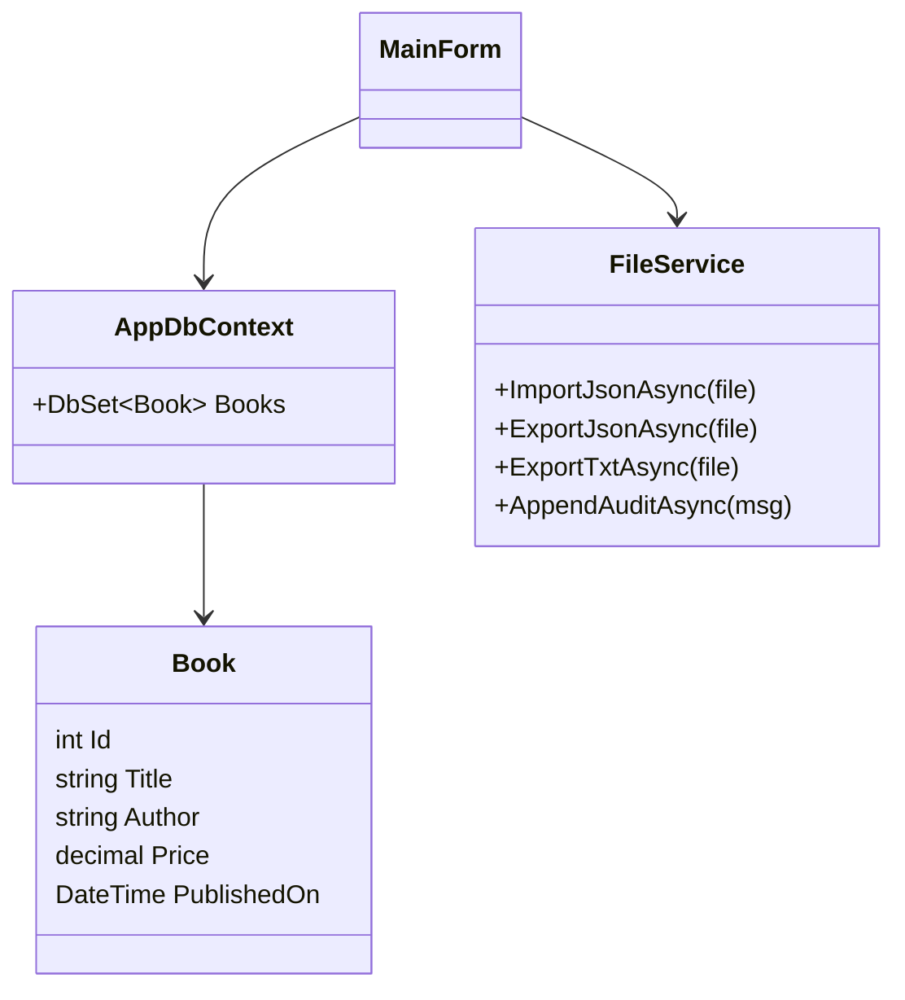

# Diagramas de Arquitetura

## Visão (C4 Container)
```mermaid
flowchart LR
    user([Usuário]) --> ui[WinForms MainForm]
    ui --> svc[FileService]
    ui --> dbctx[AppDbContext (EF Core)]
    dbctx --> db[(SQLite)]
    svc --> files[[JSON / TXT / audit.log]]
```

## Diagrama de Classes (simplificado)

