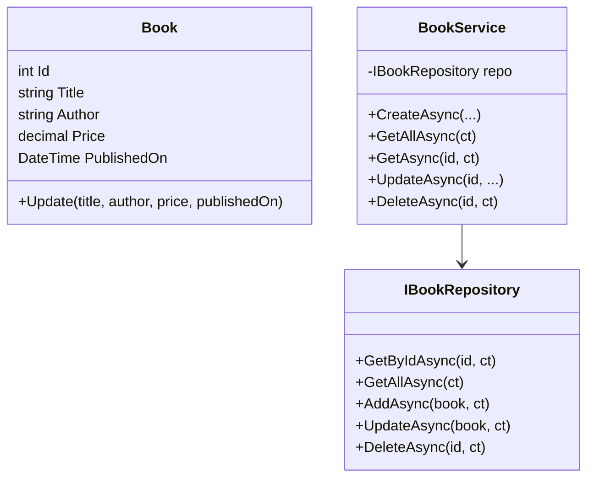

# Diagramas de Arquitetura

## C4 (Container) – Visão Geral
```mermaid
flowchart LR
    user([Usuário]) --> web[ASP.NET Core Web (API)]
    web --> app[Application (Serviços)]
    app --> domain[Domain (Entidades)]
    app --> infra[Infrastructure (EF Core + Repositórios + FileService)]
    infra --> db[(SQLite DB)]
    infra --> files[[Arquivos JSON/TXT + audit.log]]
```

## Diagrama de Classes (simplificado)


> Os diagramas acima podem ser visualizados diretamente no GitHub/VS Code com preview de Mermaid.
